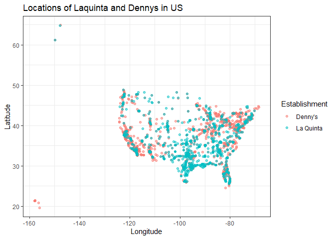
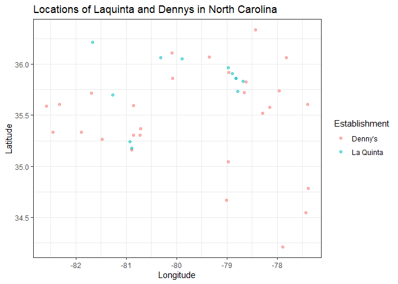
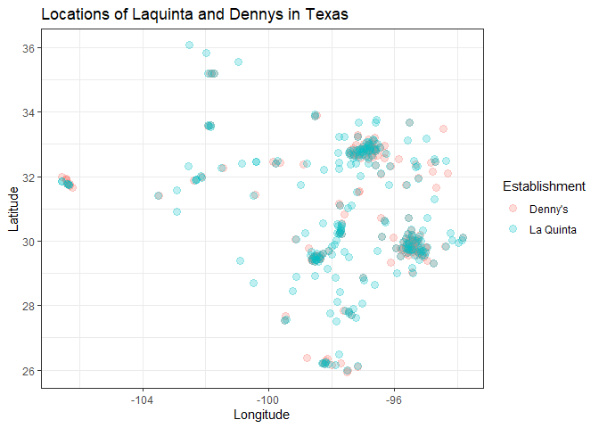

Lab 04 - La Quinta is Spanish for next to Denny’s, Pt. 1
================
Bob Dwyer
Insert date here

### Load packages and data

``` r
library(tidyverse) 
library(here)
```

``` r
#could not install dsbox
#could not load data from url
#manually load data files

load(here("data", "dennys.rda"))
load(here("data", "laquinta.rda"))
states <- read_csv("data/states.csv")
```

### Exercise 1

``` r
#What are the dimensions of the Denny’s dataset?
nrow(dennys) 
```

    ## [1] 1643

``` r
ncol(dennys) 
```

    ## [1] 6

``` r
#What does each row in the dataset represent?
head(dennys) #each row represents a location
```

    ## # A tibble: 6 x 6
    ##   address                        city       state zip   longitude latitude
    ##   <chr>                          <chr>      <chr> <chr>     <dbl>    <dbl>
    ## 1 2900 Denali                    Anchorage  AK    99503    -150.      61.2
    ## 2 3850 Debarr Road               Anchorage  AK    99508    -150.      61.2
    ## 3 1929 Airport Way               Fairbanks  AK    99701    -148.      64.8
    ## 4 230 Connector Dr               Auburn     AL    36849     -85.5     32.6
    ## 5 224 Daniel Payne Drive N       Birmingham AL    35207     -86.8     33.6
    ## 6 900 16th St S, Commons on Gree Birmingham AL    35294     -86.8     33.5

``` r
#What are the variables?
glimpse(dennys) #address, city, state, zip, long., lat.
```

    ## Rows: 1,643
    ## Columns: 6
    ## $ address   <chr> "2900 Denali", "3850 Debarr Road", "1929 Airport Way", "230 ~
    ## $ city      <chr> "Anchorage", "Anchorage", "Fairbanks", "Auburn", "Birmingham~
    ## $ state     <chr> "AK", "AK", "AK", "AL", "AL", "AL", "AL", "AL", "AL", "AL", ~
    ## $ zip       <chr> "99503", "99508", "99701", "36849", "35207", "35294", "35056~
    ## $ longitude <dbl> -149.8767, -149.8090, -147.7600, -85.4681, -86.8317, -86.803~
    ## $ latitude  <dbl> 61.1953, 61.2097, 64.8366, 32.6033, 33.5615, 33.5007, 34.206~

### Exercise 2

``` r
#What are the dimensions of the LaQuinta’s dataset?
nrow(laquinta) 
```

    ## [1] 909

``` r
ncol(laquinta) 
```

    ## [1] 6

``` r
#What does each row in the dataset represent?
head(laquinta) #each row represents a location
```

    ## # A tibble: 6 x 6
    ##   address                    city         state zip   longitude latitude
    ##   <chr>                      <chr>        <chr> <chr>     <dbl>    <dbl>
    ## 1 793 W. Bel Air Avenue      "\nAberdeen" MD    21001     -76.2     39.5
    ## 2 3018 CatClaw Dr            "\nAbilene"  TX    79606     -99.8     32.4
    ## 3 3501 West Lake Rd          "\nAbilene"  TX    79601     -99.7     32.5
    ## 4 184 North Point Way        "\nAcworth"  GA    30102     -84.7     34.1
    ## 5 2828 East Arlington Street "\nAda"      OK    74820     -96.6     34.8
    ## 6 14925 Landmark Blvd        "\nAddison"  TX    75254     -96.8     33.0

``` r
#What are the variables?
glimpse(laquinta) #address, city, state, zip, long., lat.
```

    ## Rows: 909
    ## Columns: 6
    ## $ address   <chr> "793 W. Bel Air Avenue", "3018 CatClaw Dr", "3501 West Lake ~
    ## $ city      <chr> "\nAberdeen", "\nAbilene", "\nAbilene", "\nAcworth", "\nAda"~
    ## $ state     <chr> "MD", "TX", "TX", "GA", "OK", "TX", "AG", "TX", "NM", "NM", ~
    ## $ zip       <chr> "21001", "79606", "79601", "30102", "74820", "75254", "20345~
    ## $ longitude <dbl> -76.18846, -99.77877, -99.72269, -84.65609, -96.63652, -96.8~
    ## $ latitude  <dbl> 39.52322, 32.41349, 32.49136, 34.08204, 34.78180, 32.95164, ~

### Exercise 3

``` r
#Q: Are there any La Quinta’s locations outside of the US? If so, which countries? What about Denny’s?

#A: There are no Denny's outside of the US, but La Quinta is international. Which was a surprise to me!!
```

### Exercise 4

``` r
#Q: Now take a look at the data. What would be some ways of determining whether or not either establishment has any locations outside the US using just the data (and not the websites).

#A: One way would be to use the state or zip code variables. State seems easier.
```

### Exercise 5

``` r
#Are there any international Dennys?
#Filter out US locations

intl_dennys <- dennys %>%
  filter(!(state %in% states$abbreviation))

#There are not.
```

### Exercise 6

``` r
#Add a country variable to the Denny’s dataset and set all observations equal to "United States."
dennys <- dennys %>%
  mutate(country = "United States")
```

### Exercise 7

``` r
#Are there any international La Quintas?
#Filter out US locations

intl_laquinta <- laquinta %>%
  filter(!(state %in% states$abbreviation))

#There are 14.
```

### Exercise 8

``` r
#Add a country variable to the La Quinta dataset. Use the case_when function to populate this variable. 

laquinta <- laquinta %>%
  mutate(country = case_when(
    state %in% state.abb ~ "United States",
    state %in% c("ON", "BC") ~ "Canada",
    state %in% c("QR", "CH", "NL", "VE", "PU", "SL", "AG") ~ "Mexico",
    state == "ANT" ~ "Colombia",
    state == "FM" ~ "Honduras")
  )

#Going forward we will work with the data from the United States only.
laquinta <- laquinta %>%
  filter(country == "United States")
```

### Exercise 9

``` r
#Q: Which states have the most and fewest Denny’s locations? 
dennys %>%
  count(state) %>%
  inner_join(states, by = c("state" = "abbreviation")) %>%
  arrange(area)
```

    ## # A tibble: 51 x 4
    ##    state     n name                    area
    ##    <chr> <int> <chr>                  <dbl>
    ##  1 DC        2 District of Columbia    68.3
    ##  2 RI        5 Rhode Island          1545. 
    ##  3 DE        1 Delaware              2489. 
    ##  4 CT       12 Connecticut           5543. 
    ##  5 NJ       10 New Jersey            8723. 
    ##  6 NH        3 New Hampshire         9349. 
    ##  7 VT        2 Vermont               9616. 
    ##  8 MA        8 Massachusetts        10554. 
    ##  9 HI        6 Hawaii               10932. 
    ## 10 MD       26 Maryland             12406. 
    ## # i 41 more rows

``` r
#A: California has the most, DE has the fewest.

#Q: What about La Quinta? 
laquinta %>%
  count(state) %>%
  inner_join(states, by = c("state" = "abbreviation")) %>%
  arrange(area)
```

    ## # A tibble: 48 x 4
    ##    state     n name             area
    ##    <chr> <int> <chr>           <dbl>
    ##  1 RI        2 Rhode Island    1545.
    ##  2 CT        6 Connecticut     5543.
    ##  3 NJ        5 New Jersey      8723.
    ##  4 NH        2 New Hampshire   9349.
    ##  5 VT        2 Vermont         9616.
    ##  6 MA        6 Massachusetts  10554.
    ##  7 MD       13 Maryland       12406.
    ##  8 WV        3 West Virginia  24230.
    ##  9 SC        8 South Carolina 32020.
    ## 10 ME        1 Maine          35380.
    ## # i 38 more rows

``` r
#A: Texas has the most, ME has the least.

#Q: Is this surprising? Why or why not? 
#A: Not really surprising as larger areas tend to have more of both.
```

### Exercise 10

``` r
#Which states have the most Denny’s locations per thousand square miles? What about La Quinta?

#add an identifier variable before combining data sets
dennys <- dennys %>%
  mutate(establishment = "Denny's")
laquinta <- laquinta %>%
  mutate(establishment = "La Quinta")

#combine using bind_rows since the datasets have the same # of columns
dn_lq <- bind_rows(dennys, laquinta)

#We can plot the locations of the two establishments using a scatter plot, and color the points by the establishment type. 

dn_lq %>%
  ggplot(mapping = aes(x = longitude,
                       y = latitude,
                       color = establishment)) +
  geom_point(alpha = .5) +
  theme_bw()+
  labs(title = "Locations of Laquinta and Dennys in US",
       x = "Longitude",
       y = "Latitude",
       color = "Establishment")
```

<!-- --> \### Exercise 11

``` r
#Filter the data for observations in North Carolina only
dn_lq %>%
  filter(state == "NC") %>%
  ggplot(mapping = aes(x = longitude,
                       y = latitude,
                       color = establishment)) +
  geom_point(alpha = .5) +
  theme_bw()+
  labs(title = "Locations of Laquinta and Dennys in North Carolina",
       x = "Longitude",
       y = "Latitude",
       color = "Establishment")
```

<!-- -->

``` r
#Q: Visually, does Mitch Hedberg’s joke appear to hold here?
#A: No.
```

### Exercise 12

``` r
#Filter the data for observations in Texas only
dn_lq %>%
  filter(state == "TX") %>%
  ggplot(mapping = aes(x = longitude,
                       y = latitude,
                       color = establishment)) +
  geom_point(size = 3, alpha = .25) +
  theme_bw()+
  labs(title = "Locations of Laquinta and Dennys in Texas",
       x = "Longitude",
       y = "Latitude",
       color = "Establishment")
```

<!-- -->

``` r
#Q: Visually, does Mitch Hedberg’s joke appear to hold here?
#A: Haha!
```
